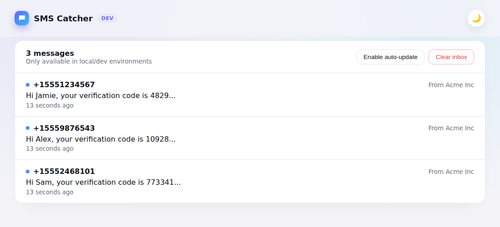
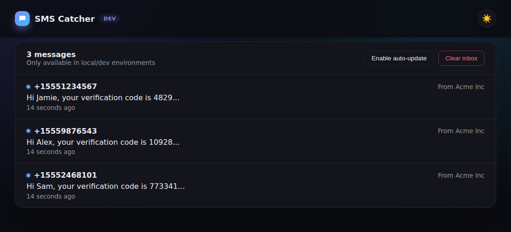
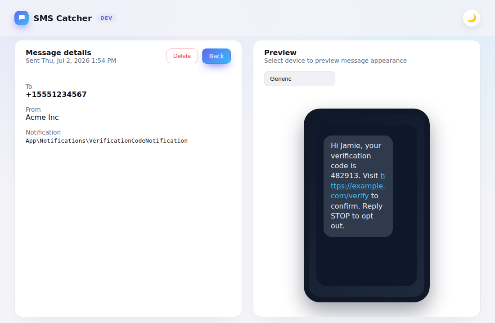

[](https://packagist.org/packages/michal78/laravel-sms-catcher)
[](https://packagist.org/packages/michal78/laravel-sms-catcher)
[](https://packagist.org/packages/michal78/laravel-sms-catcher)
[](https://github.com/michal78/laravel-sms-catcher/actions/workflows/tests.yml)

# Laravel SMS Catcher

A development-only Laravel package that captures SMS notifications and displays them in a beautiful, phone-inspired inbox – think Mailpit, but for your `sms` notification channel.

## Screenshots

### SMS Inbox Dashboard




*The main inbox view displays all captured SMS messages with sender, recipient, and timestamp information, and supports light/dark themes.*

### Message Detail View



*Click any message to see the full details alongside a phone-style preview (with a device selector), making it easy to verify how your SMS will appear to recipients.*

## Requirements

- PHP 8.2+
- Laravel (`illuminate/support` and `illuminate/notifications`) 10.x, 11.x, 12.x, or 13.x

## Installation

Require the package in your application as a dev dependency. Until a tagged
release is published you will need to target the `dev-main` branch explicitly:

```bash
composer require --dev michal78/laravel-sms-catcher
```

The package is auto-discovered by Laravel, but you can manually register the service provider if you have discovery disabled:

```php
// config/app.php
'providers' => [
    // ...
    SmsCatcher\SmsCatcherServiceProvider::class,
];
```

## Configuration

By default the dashboard is only enabled when your application is running in the `local` environment or when `APP_DEBUG=true`. You can override this behaviour via the `SMS_CATCHER_ENABLED` environment variable.

Publish the configuration file if you would like to customise the dashboard path or storage location:

```bash
php artisan vendor:publish --tag=sms-catcher-config
```

This will create `config/sms-catcher.php` with the following options:

- `enabled`: Toggle the catcher on/off.
- `route.prefix`: URL prefix for the dashboard (defaults to `/sms-catcher`).
- `route.middleware`: Middleware stack wrapping the dashboard routes.
- `storage_path`: File that stores captured messages.

## Usage

Trigger any Laravel notification that uses the `sms` channel and the payload will be recorded automatically. Visit the dashboard (default at `http://your-app.test/sms-catcher`) to see the inbox:

- Inbox view summarises each message.
- Click a message to view details and a phone-style preview.
- Clear individual messages or wipe the entire inbox.

Messages are stored as JSON within your application's storage folder (`storage/logs/sms-catcher.json`). The file is safe to delete; it will be recreated as new messages arrive. Since the `storage/logs` directory is typically excluded from version control in Laravel applications, the captured messages will not be committed to your repository.

> **Note**: The catcher inspects notifications by invoking their `toSms` method. Ensure your notifications implement this method and return either a string, array, or object containing the text body.

## Security

This package is intended for local development only. Do not enable it in production environments.

## Development

Install dependencies and run the test suite, code style checks, and static analysis locally:

```bash
composer install
composer test          # PHPUnit
composer format:test   # Laravel Pint (--test)
composer format         # Laravel Pint (auto-fix)
composer analyse        # PHPStan / Larastan
```

These same checks run automatically on every push and pull request via GitHub Actions (see `.github/workflows`).

## Changelog

Please see [CHANGELOG.md](CHANGELOG.md) for recent changes.

## Contributing

Issues and pull requests are welcome. Please run `composer test`, `composer format:test`, and `composer analyse` before submitting a PR.

## License

The MIT License (MIT). Please see [LICENSE](LICENSE) for more information.
